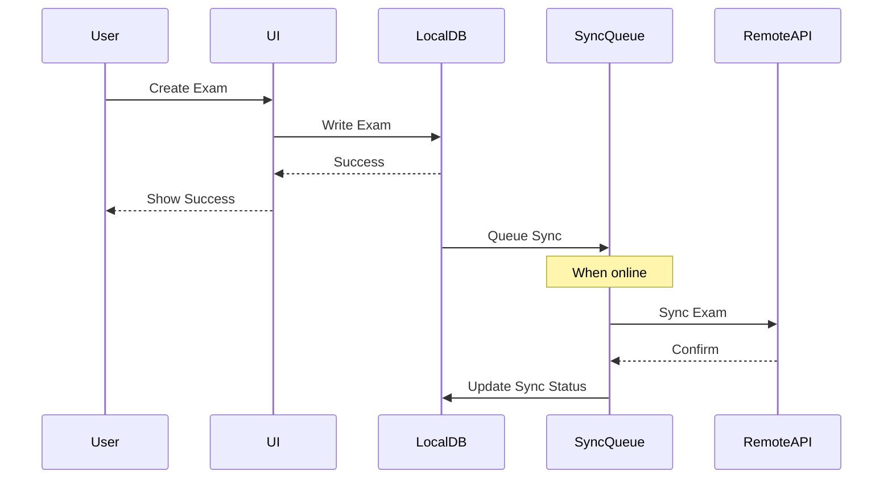
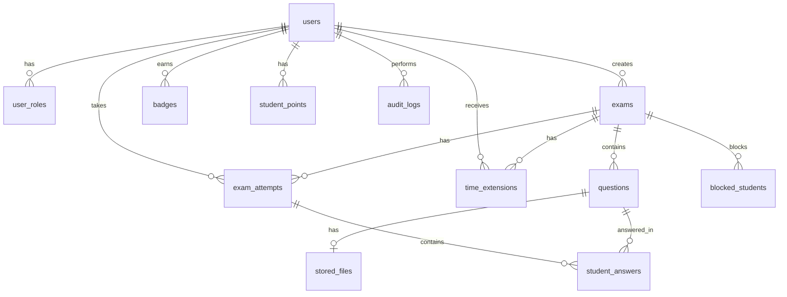
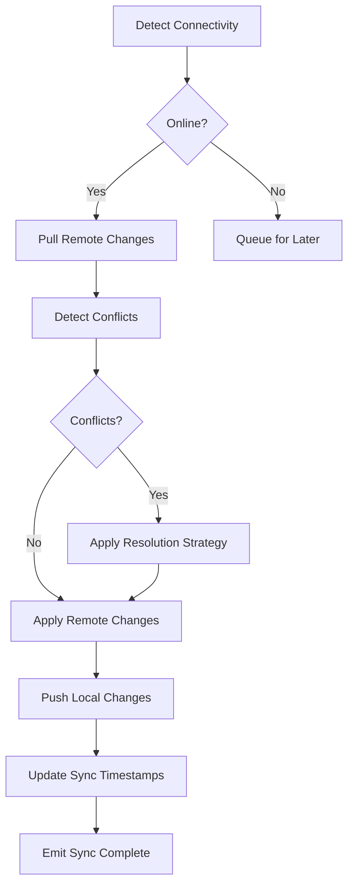
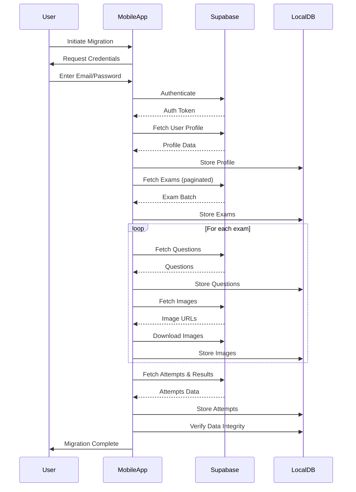

# Design Document: Offline Mobile Exam Management App

## Overview

### Purpose

This design document specifies the technical architecture for converting the existing React + TypeScript + Supabase web-based exam management system into a native mobile application that operates 100% offline. The mobile app will support both iOS and Android platforms, replacing cloud-based Supabase storage with local database storage while maintaining all existing features and adding new capabilities including gamification, time extensions, and comprehensive audit logging.

### Design Goals

1. **Offline-First Architecture**: All core functionality must work without internet connectivity
2. **Cross-Platform Consistency**: Identical features and behavior on iOS and Android
3. **Data Integrity**: Robust local storage with ACID guarantees and conflict resolution
4. **Performance**: Responsive UI with <500ms load times and 60 FPS scrolling
5. **Security**: AES-256 encryption for data at rest, TLS 1.3 for data in transit
6. **Seamless Migration**: One-time data import from existing web app
7. **Extensibility**: Modular architecture supporting future feature additions

### Technology Stack

**Mobile Framework**: React Native 0.73+
- Chosen for code reusability with existing React codebase
- Strong ecosystem and community support
- Native performance with platform-specific optimizations
- Hot reload for rapid development

**Local Database**: WatermelonDB
- Built specifically for React Native with offline-first design
- Lazy loading and observable queries for performance
- Multi-threaded architecture (JSI bridge)
- SQLite backend with full ACID compliance
- Built-in sync primitives for conflict resolution

**State Management**: Zustand + React Query
- Zustand for global app state (auth, settings, UI)
- React Query for data fetching and caching during sync
- Lightweight and performant compared to Redux

**Navigation**: React Navigation 6
- Native stack navigator for optimal performance
- Deep linking support for exam invitations
- Persistent navigation state

**UI Component Library**: React Native Paper + Custom Components
- Material Design 3 compliance
- Accessibility built-in (screen reader support)
- Theming support (light/dark mode)
- Platform-specific adaptations

**Image Handling**: React Native Image Picker + React Native Fast Image
- Camera and gallery access
- Image compression and optimization
- Caching for performance

**Encryption**: react-native-encrypted-storage + Crypto API
- AES-256-GCM encryption
- Platform-specific secure storage (Keychain/Keystore)
- Biometric authentication integration

**Testing**: Jest + React Native Testing Library + fast-check
- Unit tests for business logic
- Property-based tests for correctness properties
- Integration tests for critical flows

**Build Tools**: 
- Expo (managed workflow) for simplified development and OTA updates
- EAS Build for native builds
- EAS Update for over-the-air updates

## Architecture

### High-Level Architecture

The application follows a layered architecture with clear separation of concerns:

```
┌─────────────────────────────────────────────────────────────┐
│                     Presentation Layer                       │
│  (React Native Components, Screens, Navigation)             │
└─────────────────────────────────────────────────────────────┘
                            │
┌─────────────────────────────────────────────────────────────┐
│                     Application Layer                        │
│  (Business Logic, State Management, Hooks)                  │
└─────────────────────────────────────────────────────────────┘
                            │
┌─────────────────────────────────────────────────────────────┐
│                       Service Layer                          │
│  (Auth, Storage, Sync, Encryption, Gamification)            │
└─────────────────────────────────────────────────────────────┘
                            │
┌─────────────────────────────────────────────────────────────┐
│                        Data Layer                            │
│  (WatermelonDB, File System, Secure Storage)                │
└─────────────────────────────────────────────────────────────┘
```

### Offline-First Design Pattern


The application implements an offline-first architecture where:

1. **Local Database as Source of Truth**: All reads and writes go to the local database first
2. **Optimistic UI Updates**: UI updates immediately on user actions without waiting for sync
3. **Background Sync**: Synchronization happens asynchronously when connectivity is available
4. **Conflict Resolution**: Automatic conflict resolution with configurable strategies
5. **Queue-Based Operations**: Failed sync operations are queued and retried with exponential backoff



### Directory Structure

```
src/
├── components/          # Reusable UI components
│   ├── common/         # Buttons, inputs, cards
│   ├── exam/           # Exam-specific components
│   ├── gamification/   # Badges, leaderboards
│   └── audit/          # Audit log viewers
├── screens/            # Screen components
│   ├── auth/           # Login, biometric setup
│   ├── admin/          # Exam management, analytics
│   ├── student/        # Exam taking, results
│   └── settings/       # App configuration
├── services/           # Business logic services
│   ├── auth/           # Authentication manager
│   ├── database/       # Database operations
│   ├── sync/           # Sync engine
│   ├── storage/        # File storage manager
│   ├── encryption/     # Encryption service
│   ├── gamification/   # Gamification engine
│   ├── timeExtension/  # Time extension manager
│   └── audit/          # Audit logger
├── models/             # WatermelonDB models
├── hooks/              # Custom React hooks
├── store/              # Zustand stores
├── navigation/         # Navigation configuration
├── utils/              # Utility functions
└── types/              # TypeScript type definitions
```

## Components and Interfaces


### 1. Auth_Manager

Manages offline authentication, session management, and biometric authentication.

**Interface**:
```typescript
interface AuthManager {
  // Authentication
  login(email: string, password: string): Promise<AuthResult>;
  logout(): Promise<void>;
  register(userData: UserRegistrationData): Promise<AuthResult>;
  
  // Session management
  getCurrentUser(): User | null;
  isAuthenticated(): boolean;
  getSession(): Session | null;
  refreshSession(): Promise<void>;
  
  // Biometric
  isBiometricAvailable(): Promise<boolean>;
  enableBiometric(): Promise<void>;
  authenticateWithBiometric(): Promise<AuthResult>;
  
  // Password management
  changePassword(oldPassword: string, newPassword: string): Promise<void>;
  resetPassword(userId: string, newPassword: string): Promise<void>;
  
  // Role management
  hasRole(role: 'admin' | 'student'): boolean;
  getUserRoles(): string[];
}

interface AuthResult {
  success: boolean;
  user?: User;
  session?: Session;
  error?: string;
}
```

**Implementation Details**:
- Passwords hashed with bcrypt (cost factor 12)
- Session tokens stored in encrypted storage
- Biometric authentication uses react-native-biometrics
- Session timeout: 7 days (configurable)
- Failed login attempts tracked (max 5 before temporary lockout)

### 2. Local_Database (WatermelonDB)

Manages all local data persistence with observable queries and lazy loading.

**Interface**:
```typescript
interface DatabaseManager {
  // Initialization
  initialize(): Promise<void>;
  reset(): Promise<void>;
  
  // Collections
  getCollection<T>(name: string): Collection<T>;
  
  // Transactions
  write<T>(action: () => Promise<T>): Promise<T>;
  
  // Queries
  query<T>(collection: string, conditions: QueryCondition[]): Query<T>;
  
  // Migrations
  migrate(version: number): Promise<void>;
  
  // Statistics
  getStorageSize(): Promise<number>;
  getRecordCount(collection: string): Promise<number>;
}
```

**Schema Design**: See Data Models section below

### 3. Storage_Manager

Manages local file storage for images and media files.

**Interface**:
```typescript
interface StorageManager {
  // Image operations
  saveImage(uri: string, metadata: ImageMetadata): Promise<string>;
  getImage(fileId: string): Promise<string>;
  deleteImage(fileId: string): Promise<void>;
  
  // Compression
  compressImage(uri: string, quality: number): Promise<string>;
  
  // Utilities
  getStorageUsage(): Promise<StorageStats>;
  clearCache(): Promise<void>;
  cleanupOrphanedFiles(): Promise<number>;
}

interface ImageMetadata {
  questionId: string;
  originalName: string;
  mimeType: string;
  size: number;
}

interface StorageStats {
  totalSize: number;
  imageCount: number;
  cacheSize: number;
  availableSpace: number;
}
```

**Implementation Details**:
- Images stored in app's document directory
- File naming: `{uuid}.{ext}`
- Compression: JPEG quality 80%, max dimension 1920px
- Encryption: AES-256-GCM for stored files
- Cleanup: Orphaned files removed on app start


### 4. Sync_Engine

Handles bidirectional synchronization with remote server when connectivity is available.

**Interface**:
```typescript
interface SyncEngine {
  // Sync operations
  sync(options?: SyncOptions): Promise<SyncResult>;
  syncCollection(collectionName: string): Promise<SyncResult>;
  
  // Status
  getSyncStatus(): SyncStatus;
  getLastSyncTime(): Date | null;
  getPendingChanges(): Promise<PendingChange[]>;
  
  // Configuration
  setSyncStrategy(strategy: SyncStrategy): void;
  setConflictResolver(resolver: ConflictResolver): void;
  
  // Events
  onSyncStart(callback: () => void): void;
  onSyncComplete(callback: (result: SyncResult) => void): void;
  onSyncError(callback: (error: Error) => void): void;
}

interface SyncOptions {
  collections?: string[];
  force?: boolean;
  direction?: 'push' | 'pull' | 'both';
}

interface SyncResult {
  success: boolean;
  pushed: number;
  pulled: number;
  conflicts: number;
  errors: SyncError[];
  duration: number;
}

interface SyncStatus {
  isSyncing: boolean;
  progress: number;
  currentCollection: string | null;
  lastSync: Date | null;
}
```

**Sync Algorithm**:
1. Check network connectivity
2. Fetch remote changes since last sync timestamp
3. Identify local changes (created, updated, deleted)
4. Detect conflicts (same record modified locally and remotely)
5. Apply conflict resolution strategy
6. Push local changes to remote
7. Pull remote changes to local
8. Update sync timestamps
9. Emit sync complete event

**Conflict Resolution Strategies**:
- **Last Write Wins**: Use timestamp to determine winner (default for profiles, settings)
- **Append Only**: Never merge, keep all versions (exam attempts, answers)
- **Manual Resolution**: Prompt user to choose (exam modifications by admins)
- **Field-Level Merge**: Merge non-conflicting fields (future enhancement)

### 5. Encryption_Service

Provides encryption for data at rest and secure key management.

**Interface**:
```typescript
interface EncryptionService {
  // Database encryption
  encryptDatabase(key: string): Promise<void>;
  decryptDatabase(key: string): Promise<void>;
  
  // File encryption
  encryptFile(filePath: string): Promise<string>;
  decryptFile(filePath: string): Promise<string>;
  
  // Key management
  generateKey(): Promise<string>;
  storeKey(key: string, identifier: string): Promise<void>;
  retrieveKey(identifier: string): Promise<string>;
  deleteKey(identifier: string): Promise<void>;
  
  // Utilities
  hash(data: string): string;
  encrypt(data: string, key: string): string;
  decrypt(data: string, key: string): string;
}
```

**Implementation Details**:
- Algorithm: AES-256-GCM
- Key derivation: PBKDF2 with 100,000 iterations
- Salt: 32 bytes random per user
- IV: 12 bytes random per encryption operation
- Platform storage: iOS Keychain (kSecAttrAccessibleWhenUnlockedThisDeviceOnly), Android Keystore


### 6. Gamification_Engine

Manages badges, achievements, points, and leaderboards.

**Interface**:
```typescript
interface GamificationEngine {
  // Badge management
  awardBadge(studentId: string, badgeType: BadgeType): Promise<Badge>;
  getBadges(studentId: string): Promise<Badge[]>;
  checkBadgeEligibility(studentId: string): Promise<BadgeType[]>;
  
  // Points
  awardPoints(studentId: string, points: number, reason: string): Promise<void>;
  getPoints(studentId: string): Promise<number>;
  
  // Achievements
  trackAchievement(studentId: string, achievement: Achievement): Promise<void>;
  getAchievements(studentId: string): Promise<Achievement[]>;
  
  // Leaderboards
  getLeaderboard(type: LeaderboardType, limit?: number): Promise<LeaderboardEntry[]>;
  getStudentRank(studentId: string, type: LeaderboardType): Promise<number>;
  
  // Streaks
  updateStreak(studentId: string): Promise<number>;
  getStreak(studentId: string): Promise<number>;
  
  // Unlockables
  checkUnlockables(studentId: string): Promise<Unlockable[]>;
}

enum BadgeType {
  FIRST_STEPS = 'first_steps',
  PERFECT_SCORE = 'perfect_score',
  SPEED_DEMON = 'speed_demon',
  STREAK_3 = 'streak_3',
  STREAK_7 = 'streak_7',
  STREAK_14 = 'streak_14',
  STREAK_30 = 'streak_30',
}

enum LeaderboardType {
  TOTAL_POINTS = 'total_points',
  AVERAGE_SCORE = 'average_score',
  COMPLETION_RATE = 'completion_rate',
}

interface LeaderboardEntry {
  rank: number;
  studentId: string;
  studentName: string;
  value: number;
  avatarUrl?: string;
}
```

**Badge Award Logic**:
- First Steps: Awarded on first exam completion
- Perfect Score: 100% score on any exam
- Speed Demon: Complete exam faster than average time (calculated per exam)
- Streak badges: Consecutive days with at least one exam completion

**Points Calculation**:
- Base points: 1 point per percentage point of score
- Speed bonus: +10 points if faster than average
- Perfect score bonus: +50 points
- Streak bonus: +5 points per day in current streak

### 7. Time_Extension_Manager

Manages time extensions and accommodations for individual students.

**Interface**:
```typescript
interface TimeExtensionManager {
  // Extension management
  grantExtension(extension: TimeExtension): Promise<void>;
  revokeExtension(extensionId: string): Promise<void>;
  updateExtension(extensionId: string, updates: Partial<TimeExtension>): Promise<void>;
  
  // Queries
  getExtension(examId: string, studentId: string): Promise<TimeExtension | null>;
  getExtensionsForExam(examId: string): Promise<TimeExtension[]>;
  getExtensionsForStudent(studentId: string): Promise<TimeExtension[]>;
  
  // Calculation
  calculateExtendedDuration(examId: string, studentId: string, baseDuration: number): Promise<number>;
  
  // Accommodation requests
  submitRequest(request: AccommodationRequest): Promise<void>;
  getPendingRequests(): Promise<AccommodationRequest[]>;
  approveRequest(requestId: string): Promise<void>;
  denyRequest(requestId: string, reason: string): Promise<void>;
}

interface TimeExtension {
  id: string;
  examId: string;
  studentId: string;
  extensionType: 'percentage' | 'fixed';
  extensionValue: number; // percentage (25, 50, 100, 150) or minutes
  grantedBy: string;
  grantedAt: Date;
  reason?: string;
}

interface AccommodationRequest {
  id: string;
  examId: string;
  studentId: string;
  justification: string;
  requestedAt: Date;
  status: 'pending' | 'approved' | 'denied';
  reviewedBy?: string;
  reviewedAt?: Date;
  denyReason?: string;
}
```


### 8. Audit_Logger

Comprehensive logging of all significant user actions and system events.

**Interface**:
```typescript
interface AuditLogger {
  // Logging
  log(entry: AuditEntry): Promise<void>;
  logExamCreated(examId: string, adminId: string): Promise<void>;
  logExamModified(examId: string, adminId: string, changes: Record<string, any>): Promise<void>;
  logExamDeleted(examId: string, adminId: string): Promise<void>;
  logExamStarted(examId: string, studentId: string, attemptId: string): Promise<void>;
  logExamSubmitted(examId: string, studentId: string, attemptId: string): Promise<void>;
  logLogin(userId: string, deviceInfo: DeviceInfo): Promise<void>;
  logLogout(userId: string): Promise<void>;
  logSecurityViolation(userId: string, violation: SecurityViolation): Promise<void>;
  
  // Queries
  getLogs(filters: AuditLogFilter): Promise<AuditEntry[]>;
  getLogsForUser(userId: string, limit?: number): Promise<AuditEntry[]>;
  getLogsForExam(examId: string, limit?: number): Promise<AuditEntry[]>;
  searchLogs(query: string): Promise<AuditEntry[]>;
  
  // Export
  exportLogs(filters: AuditLogFilter, format: 'csv' | 'json'): Promise<string>;
  
  // Maintenance
  archiveLogs(olderThan: Date): Promise<number>;
  purgeLogs(olderThan: Date): Promise<number>;
}

interface AuditEntry {
  id: string;
  timestamp: Date;
  userId: string;
  actionType: AuditActionType;
  entityType?: string;
  entityId?: string;
  metadata?: Record<string, any>;
  ipAddress?: string;
  deviceId?: string;
}

enum AuditActionType {
  EXAM_CREATED = 'exam_created',
  EXAM_MODIFIED = 'exam_modified',
  EXAM_DELETED = 'exam_deleted',
  EXAM_STARTED = 'exam_started',
  EXAM_SUBMITTED = 'exam_submitted',
  GRADE_MODIFIED = 'grade_modified',
  LOGIN = 'login',
  LOGOUT = 'logout',
  SECURITY_VIOLATION = 'security_violation',
  DATA_EXPORTED = 'data_exported',
  DATA_IMPORTED = 'data_imported',
}

interface AuditLogFilter {
  startDate?: Date;
  endDate?: Date;
  userId?: string;
  actionType?: AuditActionType;
  examId?: string;
  limit?: number;
  offset?: number;
}
```

**Retention Policy**:
- Active logs: 365 days in main database
- Archived logs: Compressed JSON files, indefinite retention
- Automatic archival: Monthly job for logs older than 365 days

## Data Models

### WatermelonDB Schema

WatermelonDB uses a declarative schema with models, collections, and relations.


#### Core Tables

**users**
```typescript
{
  id: string (primary key, uuid)
  email: string (indexed, unique)
  password_hash: string
  full_name: string
  avatar_url: string?
  created_at: number (timestamp)
  updated_at: number (timestamp)
  last_sync_at: number? (timestamp)
  _status: string (synced | created | updated | deleted)
  _changed: string (comma-separated field names)
}
```

**user_roles**
```typescript
{
  id: string (primary key, uuid)
  user_id: string (foreign key -> users, indexed)
  role: string (enum: 'admin' | 'student')
  created_at: number (timestamp)
  _status: string
  _changed: string
}
```

**exams**
```typescript
{
  id: string (primary key, uuid)
  title: string
  description: string?
  created_by: string (foreign key -> users, indexed)
  duration_minutes: number
  start_time: number? (timestamp)
  end_time: number? (timestamp)
  max_attempts: number
  shuffle_questions: boolean
  shuffle_options: boolean
  is_published: boolean (indexed)
  results_published: boolean
  created_at: number (timestamp, indexed)
  updated_at: number (timestamp)
  last_sync_at: number? (timestamp)
  _status: string
  _changed: string
}
```

**questions**
```typescript
{
  id: string (primary key, uuid)
  exam_id: string (foreign key -> exams, indexed)
  question_text: string
  options: string (JSON array)
  correct_option_index: number
  feedback_type: string (enum: 'instant' | 'hidden')
  marks: number
  order_index: number (indexed)
  image_file_id: string?
  created_at: number (timestamp)
  _status: string
  _changed: string
}
```

**exam_attempts**
```typescript
{
  id: string (primary key, uuid)
  exam_id: string (foreign key -> exams, indexed)
  student_id: string (foreign key -> users, indexed)
  started_at: number (timestamp, indexed)
  submitted_at: number? (timestamp)
  is_submitted: boolean (indexed)
  total_score: number?
  max_score: number?
  time_spent_seconds: number?
  extended_duration_minutes: number? (if time extension applied)
  created_at: number (timestamp)
  last_sync_at: number? (timestamp)
  _status: string
  _changed: string
}
```

**student_answers**
```typescript
{
  id: string (primary key, uuid)
  attempt_id: string (foreign key -> exam_attempts, indexed)
  question_id: string (foreign key -> questions, indexed)
  selected_option_index: number?
  is_correct: boolean?
  time_spent_seconds: number
  answered_at: number (timestamp)
  _status: string
  _changed: string
}
```

**blocked_students**
```typescript
{
  id: string (primary key, uuid)
  exam_id: string (foreign key -> exams, indexed)
  student_id: string (foreign key -> users, indexed)
  blocked_at: number (timestamp)
  reason: string?
  _status: string
  _changed: string
}
```


#### Gamification Tables

**badges**
```typescript
{
  id: string (primary key, uuid)
  student_id: string (foreign key -> users, indexed)
  badge_type: string (enum: BadgeType)
  earned_at: number (timestamp, indexed)
  exam_id: string? (foreign key -> exams, for context)
  metadata: string? (JSON for additional context)
  _status: string
  _changed: string
}
```

**student_points**
```typescript
{
  id: string (primary key, uuid)
  student_id: string (foreign key -> users, indexed, unique)
  total_points: number (indexed for leaderboard)
  last_updated: number (timestamp)
  _status: string
  _changed: string
}
```

**point_transactions**
```typescript
{
  id: string (primary key, uuid)
  student_id: string (foreign key -> users, indexed)
  points: number
  reason: string
  exam_id: string? (foreign key -> exams)
  attempt_id: string? (foreign key -> exam_attempts)
  created_at: number (timestamp, indexed)
  _status: string
  _changed: string
}
```

**student_streaks**
```typescript
{
  id: string (primary key, uuid)
  student_id: string (foreign key -> users, indexed, unique)
  current_streak: number
  longest_streak: number
  last_activity_date: string (YYYY-MM-DD format, indexed)
  _status: string
  _changed: string
}
```

**leaderboard_cache**
```typescript
{
  id: string (primary key, uuid)
  leaderboard_type: string (enum: LeaderboardType, indexed)
  student_id: string (foreign key -> users, indexed)
  rank: number
  value: number
  calculated_at: number (timestamp)
  _status: string
  _changed: string
}
```

#### Time Extension Tables

**time_extensions**
```typescript
{
  id: string (primary key, uuid)
  exam_id: string (foreign key -> exams, indexed)
  student_id: string (foreign key -> users, indexed)
  extension_type: string (enum: 'percentage' | 'fixed')
  extension_value: number
  granted_by: string (foreign key -> users)
  granted_at: number (timestamp)
  reason: string?
  _status: string
  _changed: string
}
```

**accommodation_requests**
```typescript
{
  id: string (primary key, uuid)
  exam_id: string (foreign key -> exams, indexed)
  student_id: string (foreign key -> users, indexed)
  justification: string
  requested_at: number (timestamp, indexed)
  status: string (enum: 'pending' | 'approved' | 'denied', indexed)
  reviewed_by: string? (foreign key -> users)
  reviewed_at: number? (timestamp)
  deny_reason: string?
  _status: string
  _changed: string
}
```

#### Audit Tables

**audit_logs**
```typescript
{
  id: string (primary key, uuid)
  timestamp: number (indexed)
  user_id: string (foreign key -> users, indexed)
  action_type: string (enum: AuditActionType, indexed)
  entity_type: string?
  entity_id: string? (indexed)
  metadata: string? (JSON)
  ip_address: string?
  device_id: string?
  _status: string (always 'synced', audit logs are append-only)
}
```

#### Sync Metadata Tables

**sync_timestamps**
```typescript
{
  id: string (primary key, uuid)
  collection_name: string (indexed, unique)
  last_pulled_at: number? (timestamp)
  last_pushed_at: number? (timestamp)
}
```

**sync_conflicts**
```typescript
{
  id: string (primary key, uuid)
  collection_name: string (indexed)
  record_id: string (indexed)
  local_version: string (JSON)
  remote_version: string (JSON)
  detected_at: number (timestamp, indexed)
  resolved_at: number? (timestamp)
  resolution_strategy: string?
  resolved_version: string? (JSON)
}
```


#### File Storage Tables

**stored_files**
```typescript
{
  id: string (primary key, uuid)
  file_path: string (local file system path)
  original_name: string
  mime_type: string
  size_bytes: number
  question_id: string? (foreign key -> questions, indexed)
  uploaded_at: number (timestamp)
  is_encrypted: boolean
  _status: string
  _changed: string
}
```

#### Database Indexes

For optimal query performance, the following indexes are created:

- `users.email` (unique)
- `user_roles.user_id`
- `exams.created_by`
- `exams.is_published`
- `exams.created_at`
- `questions.exam_id`
- `questions.order_index`
- `exam_attempts.exam_id`
- `exam_attempts.student_id`
- `exam_attempts.started_at`
- `exam_attempts.is_submitted`
- `student_answers.attempt_id`
- `student_answers.question_id`
- `blocked_students.exam_id`
- `blocked_students.student_id`
- `badges.student_id`
- `badges.earned_at`
- `student_points.student_id` (unique)
- `student_points.total_points`
- `point_transactions.student_id`
- `point_transactions.created_at`
- `student_streaks.student_id` (unique)
- `student_streaks.last_activity_date`
- `leaderboard_cache.leaderboard_type`
- `leaderboard_cache.student_id`
- `time_extensions.exam_id`
- `time_extensions.student_id`
- `accommodation_requests.exam_id`
- `accommodation_requests.student_id`
- `accommodation_requests.status`
- `accommodation_requests.requested_at`
- `audit_logs.timestamp`
- `audit_logs.user_id`
- `audit_logs.action_type`
- `audit_logs.entity_id`
- `sync_timestamps.collection_name` (unique)
- `sync_conflicts.collection_name`
- `sync_conflicts.record_id`
- `sync_conflicts.detected_at`
- `stored_files.question_id`

### Data Relationships




## Synchronization Strategy

### Sync Architecture

The synchronization system uses a pull-push model with conflict detection and resolution:



### Sync Protocol

**Pull Phase**:
1. Query remote API for changes since `last_pulled_at` timestamp per collection
2. Receive batch of changed records with their timestamps
3. For each record:
   - Check if local version exists
   - Compare timestamps
   - If remote is newer and no local changes: apply remote version
   - If both changed: mark as conflict
4. Update `last_pulled_at` timestamp

**Push Phase**:
1. Query local database for records where `_status` is 'created' or 'updated'
2. Batch records by collection (max 100 per batch)
3. Send batch to remote API
4. On success: mark records as 'synced', clear `_changed` field
5. On failure: keep status, add to retry queue
6. Update `last_pushed_at` timestamp

**Conflict Detection**:
- A conflict occurs when both local and remote versions have `updated_at` > `last_sync_at`
- Conflicts are stored in `sync_conflicts` table
- Resolution strategies applied based on collection type

### Conflict Resolution Strategies

**Last Write Wins (LWW)**:
- Used for: user profiles, settings, exam metadata
- Logic: Compare `updated_at` timestamps, keep newer version
- Discard older version completely

**Append Only**:
- Used for: exam attempts, student answers, audit logs, point transactions
- Logic: Never merge or overwrite, treat as independent records
- Both versions kept with unique IDs

**Manual Resolution**:
- Used for: exam questions when admin modifies on multiple devices
- Logic: Present both versions to user, let them choose or merge
- UI shows diff view with side-by-side comparison

**Field-Level Merge** (future enhancement):
- Merge non-conflicting fields automatically
- Only flag truly conflicting fields for manual resolution

### Sync Optimization

**Incremental Sync**:
- Only sync records changed since last sync
- Use indexed `updated_at` and `last_sync_at` fields
- Reduces bandwidth and processing time

**Batching**:
- Group records into batches of 100
- Reduces HTTP request overhead
- Allows progress tracking

**Compression**:
- Gzip compress sync payloads
- Reduces bandwidth by ~70% for text data
- Especially effective for large exam content

**Background Sync**:
- Use React Native Background Fetch for periodic sync
- Sync when app is backgrounded (iOS: 15 min intervals, Android: flexible)
- Respect user's sync preferences (WiFi only, etc.)

**Delta Sync for Large Objects**:
- For exams with many questions, send only changed questions
- Use `_changed` field to track modified fields
- Reduces payload size for partial updates

### Network Handling

**Connectivity Detection**:
```typescript
interface NetworkManager {
  isConnected(): Promise<boolean>;
  getConnectionType(): Promise<'wifi' | 'cellular' | 'none'>;
  onConnectivityChange(callback: (connected: boolean) => void): void;
}
```

**Retry Logic**:
- Exponential backoff: 1s, 2s, 4s, 8s, 16s, 32s (max)
- Max retries: 6 attempts
- After max retries: queue for next manual sync or connectivity change

**Bandwidth Optimization**:
- Compress images before upload
- Use thumbnail versions for sync (full resolution on demand)
- Implement resumable uploads for large files

## Security Architecture

### Encryption at Rest

**Database Encryption**:
- WatermelonDB with SQLCipher integration
- AES-256-GCM encryption
- Key derivation: PBKDF2-HMAC-SHA256, 100,000 iterations
- Unique salt per user (32 bytes)
- Key stored in platform secure storage

**File Encryption**:
- Individual file encryption with AES-256-GCM
- Unique IV per file (12 bytes)
- Encryption key derived from master key
- File format: `[IV:12][Encrypted Data][Auth Tag:16]`

**Secure Storage**:
- iOS: Keychain with `kSecAttrAccessibleWhenUnlockedThisDeviceOnly`
- Android: EncryptedSharedPreferences with AES-256-GCM
- Biometric keys: Hardware-backed keystore when available

### Encryption in Transit

**TLS Configuration**:
- TLS 1.3 required (fallback to TLS 1.2)
- Certificate pinning for API endpoints
- Perfect forward secrecy (PFS) cipher suites only
- HSTS enforcement

**API Authentication**:
- JWT tokens for authenticated requests
- Token refresh mechanism (access token: 15 min, refresh token: 7 days)
- Token stored in encrypted storage
- Automatic token rotation

### Authentication Security

**Password Security**:
- Bcrypt hashing with cost factor 12
- Minimum password requirements: 8 characters, 1 uppercase, 1 lowercase, 1 number
- Password strength meter in UI
- Prevent common passwords (top 10,000 list)

**Biometric Authentication**:
- FaceID/TouchID on iOS
- Fingerprint/Face Unlock on Android
- Fallback to password if biometric fails
- Biometric key stored in hardware-backed keystore
- Re-authentication required after 7 days

**Session Management**:
- Session timeout: 7 days of inactivity
- Automatic logout on app termination (configurable)
- Single session per device (optional multi-device support)
- Session invalidation on password change

**Failed Login Protection**:
- Max 5 failed attempts
- Temporary lockout: 5 minutes after 5 failures
- Exponential lockout: 15 min, 30 min, 1 hour for repeated failures
- Audit log entry for failed attempts

### Data Protection

**Sensitive Data Handling**:
- Passwords never stored in plaintext
- Session tokens encrypted at rest
- Exam answers encrypted in database
- PII (email, name) encrypted in backups

**Memory Protection**:
- Clear sensitive data from memory after use
- Disable screenshots in sensitive screens (exam taking, login)
- Prevent data leakage through logs (sanitize before logging)

**Secure Deletion**:
- Overwrite deleted records with random data
- Secure file deletion (overwrite before unlink)
- Clear cache on logout

### Audit and Compliance

**Audit Logging**:
- All authentication events logged
- All data modifications logged
- Security violations logged with details
- Logs encrypted and tamper-evident

**Compliance Considerations**:
- GDPR: User data export, right to deletion
- FERPA: Student data protection (US education)
- Local data residency (all data on device)
- Parental consent for minors (age verification)

## Performance Optimization

### Database Performance

**Query Optimization**:
- Use WatermelonDB's lazy loading for large collections
- Implement pagination for lists (50 items per page)
- Use database indexes on all foreign keys and frequently queried fields
- Avoid N+1 queries with eager loading of relations

**Write Optimization**:
- Batch writes in transactions
- Use WatermelonDB's batch API for bulk operations
- Debounce frequent writes (e.g., answer saves during exam)
- Background thread for non-critical writes

**Cache Strategy**:
- In-memory cache for frequently accessed data (current user, active exam)
- LRU cache for images (max 50 MB)
- Cache invalidation on data updates
- Preload next questions during exam taking

### UI Performance

**Rendering Optimization**:
- Use React.memo for expensive components
- Virtualized lists with FlashList for long lists
- Lazy load images with progressive loading
- Skeleton screens for loading states

**Animation Performance**:
- Use native driver for animations (60 FPS)
- Avoid layout animations during scrolling
- Use LayoutAnimation for simple transitions
- Optimize re-renders with useMemo and useCallback

**Bundle Size Optimization**:
- Code splitting by screen
- Lazy load non-critical features
- Tree shaking for unused code
- Hermes engine for faster startup (Android)

### Memory Management

**Image Memory**:
- Compress images on upload (JPEG quality 80%)
- Resize images to max 1920px dimension
- Use thumbnail versions in lists
- Clear image cache when memory warning received

**Database Memory**:
- Limit query result sets
- Use streaming for large exports
- Close database connections when not needed
- Monitor memory usage with performance profiler

**Leak Prevention**:
- Cleanup event listeners on unmount
- Cancel pending async operations on unmount
- Avoid circular references in closures
- Use WeakMap for object caching

### Startup Performance

**App Launch Optimization**:
- Lazy initialize non-critical services
- Defer database migrations to background
- Preload critical data only (current user, active exams)
- Use splash screen for perceived performance

**Cold Start Target**: < 2 seconds
**Warm Start Target**: < 500ms

### Network Performance

**Request Optimization**:
- Batch API requests where possible
- Use HTTP/2 multiplexing
- Implement request deduplication
- Cache API responses with TTL

**Offline Performance**:
- All reads from local database (< 50ms)
- Optimistic UI updates (instant feedback)
- Background sync doesn't block UI

## Migration Strategy

### Data Migration from Web App

**Migration Flow**:


**Migration Steps**:

1. **Authentication**:
   - User enters existing web app credentials
   - Authenticate against Supabase
   - Store auth token for migration session

2. **Profile Migration**:
   - Fetch user profile and roles
   - Create local user record
   - Set up local authentication

3. **Exam Migration**:
   - Fetch all exams created by or accessible to user
   - Paginate requests (50 exams per batch)
   - Store exams with all metadata

4. **Question Migration**:
   - For each exam, fetch all questions
   - Preserve question order
   - Migrate question options (JSON)

5. **Image Migration**:
   - Download all question images
   - Compress and encrypt locally
   - Update question references

6. **Attempt Migration**:
   - Fetch all exam attempts and results
   - Migrate student answers
   - Preserve timestamps and scores

7. **Verification**:
   - Count records in local vs remote
   - Verify data integrity (checksums)
   - Display migration summary

**Error Handling**:
- Resume from last successful batch on failure
- Skip corrupted records with user notification
- Retry failed downloads (max 3 attempts)
- Allow partial migration (skip specific exams)

**Progress Tracking**:
- Display progress bar with percentage
- Show current operation (e.g., "Downloading exam 5 of 20")
- Estimate time remaining
- Allow cancellation (with resume option)

### Schema Migration

**Version Management**:
- Schema version stored in database
- Migration scripts for each version increment
- Automatic migration on app update

**Migration Script Example**:
```typescript
const migrations = [
  {
    version: 1,
    up: async (db) => {
      await db.createTable('users', schema.users);
      await db.createTable('exams', schema.exams);
      // ... other tables
    }
  },
  {
    version: 2,
    up: async (db) => {
      await db.addColumn('exams', 'results_published', 'boolean');
    }
  },
  // ... future migrations
];
```

**Migration Safety**:
- Backup database before migration
- Rollback on migration failure
- Test migrations on copy of production data
- Gradual rollout with feature flags

